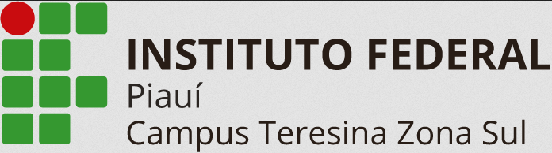

# 
### Repositório de Atividades

Este repositório foi criado com o propósito de armazenar as atividades realizadas ao longo da disciplina de 'Introdução à Programação Web' como parte do curso de Licenciatura em Informática. Ele foi estabelecido para facilitar o acompanhamento do nosso progresso, tanto pelo professor quanto por nós mesmos.

### Conteúdos das aulas

- Arquitetura Cliente-Servidor

- Conhecendo as tags do HTML (Meta, h1, h2, h3, br, hr, p, strong, ul, li, ol, img)

- Trabalhando com links

- Table: Como era feito no paradigma anterior (table, td, th, tr) 

- Forms: elementos utilizados para colher informações sobre os usuários pertinentes ao sistema.

- PROJETO 01: O projeto JM Viagens traz o protótipo de um site de turismo de vendas de pacotes de viagens, o site é estruturada através de tabelas, tem navegação através de links e outros recursos vistos nas aulas.

- CSS: A identidade visual de todo projeto é de extrema importância, na internet a tecnologia que nos ajuda é o CSS as folhas de estilo em cascata.
