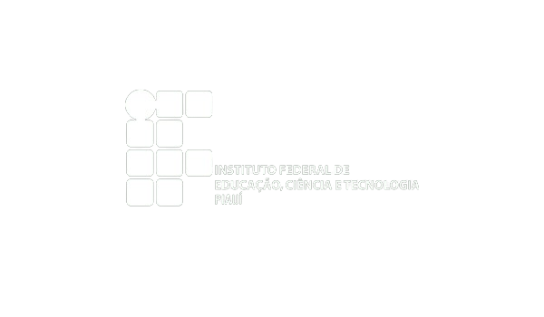

   

## Introdução a Web 1: Front-End (2023.2)
### Repositório de Atividades

Este repositório foi criado com o propósito de armazenar as atividades realizadas ao longo da disciplina de 'Introdução à Programação Web' como parte do curso de Licenciatura em Informática. Ele foi estabelecido para facilitar o acompanhamento do nosso progresso, tanto pelo professor quanto por nós mesmos.

### Conteúdos das aulas

- Arquitetura Cliente-Servidor

- Conhecendo as tags do HTML (Meta, h1, h2, h3, br, hr, p, strong, ul, li, ol, img)

- Trabalhando com links

- Table: Como era feito no paradigma anterior (table, td, th, tr) 

- Forms: elementos utilizados para colher informações sobre os usuários pertinentes ao sistema.

- PROJETO 01: O projeto JM Viagens traz o protótipo de um site de turismo de vendas de pacotes de viagens, o site é estruturada através de tabelas, tem navegação através de links e outros recursos vistos nas aulas.

- CSS: A identidade visual de todo projeto é de extrema importância, na internet a tecnologia que nos ajuda é o CSS as folhas de estilo em cascata.

## Introducão a Web 2: Back-End (2024.1)
### Repositório de Atividades

Assim como anteriormente, o objetivo desse repositório é assegurar a disponibilidade das atividades de qualquer dispositivo com acesso a internet. Nesse período vamos desenvolver nossas habilidades nas tecnologias:

- Linguagem de programação PHP: segundo o portal Wikipédia [https://pt.wikipedia.org/wiki/PHP] é uma linguagem interpretada livre, usada originalmente apenas para o desenvolvimento de aplicações presentes e atuantes no lado do servidor, capazes de gerar conteúdo dinâmico na World Wide Web.
  
- Linguagem de programação Python: segundo o portal Wikipédia [https://pt.wikipedia.org/wiki/Python] Python é uma linguagem de programação de alto nível, interpretada de script, imperativa, orientada a objetos, funcional, de tipagem dinâmica e forte. Foi lançada por Guido van Rossum em 1991.
  
- Framework Django: segundo o portal Wikipédia [https://pt.wikipedia.org/wiki/Django_(framework_web)] Django é um framework para desenvolvimento rápido para web, escrito em Python, que utiliza o padrão model-template-view. Foi criado originalmente como sistema para gerenciar um site jornalístico na cidade de Lawrence, no Kansas. Tornou-se um projeto de código aberto e foi publicado sob a licença BSD em 2005.

### Conteúdos das aulas

- 22/02/2024: Revisão do Conceito de navegação em diretórios (../../nomepasta); Passagem de parâmetos em funções;
- 28/02/2024: Realizando operações através de funções e exibindo nas views. Desafio #01 - Enviar dados de um formulário para um template.
- 29/02/2024: Apresentado o conceito de model, classe, métodos e atributos. Desafio #02 - Calculadora.
- 06/03/2024 - 07/03/2024: Trabalhando a navegação entre páginas. Desafio #03 - Sistema de Controle Academico
